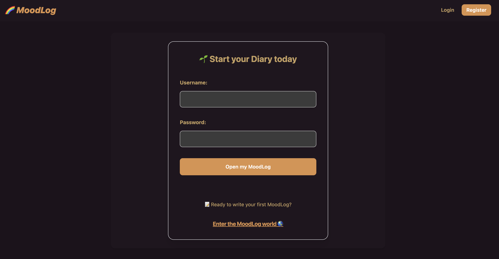
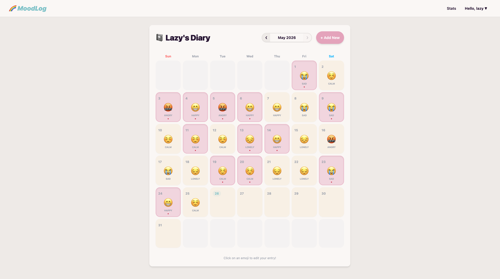
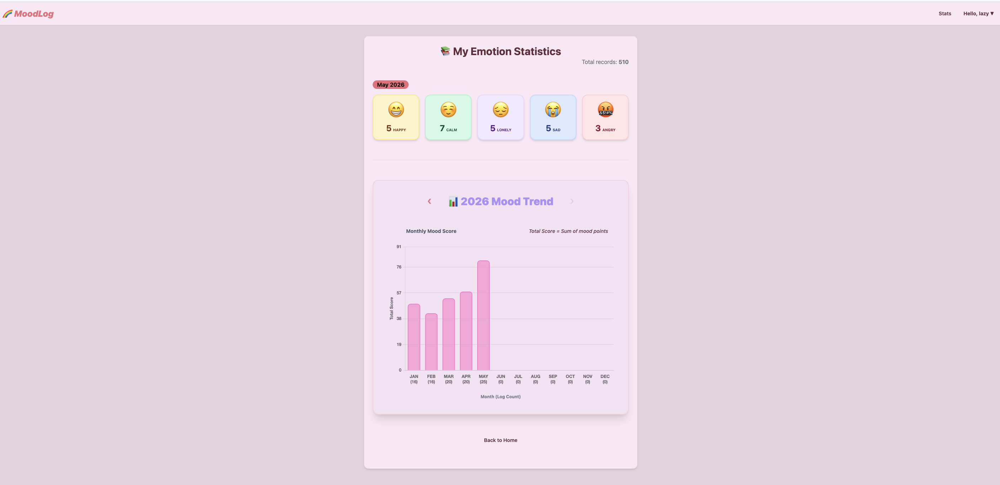

# 🌈 MoodLog: Personal Emotion Tracker

## ✨ Project Overview
**MoodLog** is a Django-based web application designed to help users track and manage their daily emotional well-being. Users can record their moods, categorize the source of their emotions, and visualize their emotional trends over time.

## 🚀 Key Features (CRUD)
- **Log Emotion (Create):** Save daily moods with specific categories and personal notes.
- **View History (Read):** Access a personalized dashboard of past emotional records.
- **Manage Entries (Update/Delete):** Modify or remove previous logs.
- **Monthly Statistics:** View summaries of emotional trends and data.

## 📂 MoodLog Project Structure

```text
moodlog_project/                # Root Project Folder
├── manage.py                   # Project Manager
├── db.sqlite3                  # Database
├── config/                     # Project Settings
│   ├── settings.py
│   └── urls.py
├── accounts/                   # App: Signup
│   ├── models.py
│   ├── views.py
│   └── templates/
├── entries/                    # App: Mood Logs & Stats
│   ├── models.py
│   ├── views.py
│   ├── urls.py
│   ├── templatetags/
│   └── templates/
│       └── entries/        
│       │   ├── index.html      # Main feed
│       │   └── stats.html      # Stats & Annual Chart
│       └── registration/       # Login
│           └── login.html
├── requirements.txt
└── venv
```

## 🛠️ Tech Stack
- **Backend:** Python, Django
- **Database:** SQLite(Development)
- **Frontend:** HTMLS, CSS3(Tailwind CSS/DaisyUI)

## 📅 Timeline
- **Presentation Date:** May 27, 2026
- **Developer:** lazy-h-null

## Screenshots


